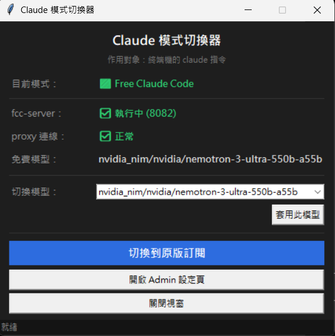

# Claude 模式切換器（終端機 claude 指令適用）

一鍵在 **原版訂閱** 與 **Free Claude Code** 之間切換 **終端機（PowerShell / cmd）裡的 `claude` 指令**，並可快速更換免費模型。

**最大好處**：切到 Free Claude Code 時，切換器會**自動在背景拉起 `fcc-server`**——你不用再另外開一個 cmd 去手動跑 fcc-server，點一下就能直接用免費模型。

> 註：Claude Desktop 內建的 Claude Code（Cowork）會強制走官方 API，無法用本工具切換；本工具只作用於終端機的 `claude` 指令。

---

## 前置需求

- Windows 10 / 11
- Python 3.12（安裝時請勾選「Add Python to PATH」）
- 已用 `uv tool` 安裝好 [Free Claude Code](https://github.com/Alishahryar1/free-claude-code)（提供 `fcc-server`）

---

## 安裝

對著 **`install.bat`** 按兩下，它會自動：

1. 偵測 Python
2. 安裝所需套件（pystray / pillow / psutil）
3. 偵測 fcc 路徑並產生設定檔 `config.json`
4. 設定**開機自動啟動**（在系統「啟動」資料夾建立捷徑）

裝完後，開機就會自動在右下角系統匣出現圓點圖示；想立刻啟動就雙擊 `2-啟動切換器.vbs`。

> 安裝過程若顯示 fcc-server「存在? False」，表示沒偵測到 fcc，請開 `config.json` 手動把 `fcc_server_exe` 改成正確路徑。

---

## 連不上免費模型？跑 `fix-fcc-tls.bat`

如果切到 Free 後模型沒回應（常見於防毒 / 公司防火牆會掃描 HTTPS 的環境），
對著 **`fix-fcc-tls.bat`** 按兩下。它會在 fcc 的環境裝 `truststore`，讓 fcc 改用 Windows 憑證驗證，解決 TLS 攔截導致連不上模型的問題。跑完重啟 fcc-server 即可（切到 Free 時會自動重啟）。

---

## 日常使用

| 操作 | 結果 |
|---|---|
| **左鍵點圖示** | 跳出狀態視窗（看狀態、換模型、切換）|
| **右鍵點圖示** | 快速切換 / 結束程式 |
| 🟦 藍點 | 目前走原版訂閱 |
| 🟩 綠點 | 目前走 Free Claude Code |

### 切換時會發生什麼

按「切換」→ 確認視窗 → 按確定後：

- 改寫環境變數 `ANTHROPIC_BASE_URL` / `ANTHROPIC_AUTH_TOKEN`（決定走訂閱還是 proxy）
- 切到 Free 時，若 fcc-server 沒開會**自動開**
- ⚠️ **要開一個「新的」終端機視窗再執行 `claude` 才會生效**；已經開著的終端機不會自動套用。

### 狀態視窗看得到

| 項目 | 說明 |
|---|---|
| 目前模式 | 原版訂閱 / Free Claude Code |
| fcc-server | 是否執行中（顯示 port）|
| proxy 連線 | health 是否回應正常 |
| 免費模型 | 目前使用的模型 |

### 換模型

- 在「切換模型」下拉框選一個，或直接輸入完整模型名（例如 `open_router/xxx`），按「套用此模型」。
- 會重啟 fcc-server（不影響目前的模式設定）。
- 想看所有可用模型 / 設定 API Key → 按「開啟 Admin 設定頁」。

---

## 設定檔 config.json

首次執行會自動產生 `config.json`（與程式同資料夾），可手動修改：

| 欄位 | 說明 |
|---|---|
| `fcc_server_exe` | fcc-server.exe 的完整路徑 |
| `fcc_env_path` | fcc 的 `.env` 檔路徑（換模型會改這裡的 `MODEL=`）|
| `tiktoken_cache_dir` | tiktoken 快取資料夾（避免啟動時下載被擋）|
| `port` | fcc-server 的 port（預設 8082；URL 由它推導）|
| `auth_token` | 寫進 `ANTHROPIC_AUTH_TOKEN` 的權杖（預設 `freecc`）|

> 刪掉 `config.json` 後重新啟動，程式會重新自動偵測並產生一份。

---

## 常見問題

- **切換後沒生效？** 一定要**開新的終端機**再跑 `claude`；舊終端機讀的是啟動當下的環境變數，不會更新。
- **怎麼確認目前走哪個模式？** 在新終端機執行 `echo %ANTHROPIC_BASE_URL%`（cmd）或 `$env:ANTHROPIC_BASE_URL`（PowerShell）。有 port（如 `8082`）= Free；空白 = 原版訂閱。
- **圖示沒出現？** 先確認有跑過 `install.bat`；再雙擊 `2-啟動切換器.vbs`。
- **模型沒回應？** 改用下拉換一個模型，或到 Admin 頁確認 API Key；若是 TLS 問題請跑 `fix-fcc-tls.bat`。

---

## 解除安裝

1. 右鍵圖示 →「結束」
2. 刪除開機捷徑：`Win + R` → 輸入 `shell:startup` → 刪掉「Claude 模式切換器」捷徑
3. 清除環境變數（讓 `claude` 回到原版訂閱）：在切換器切回「原版訂閱」即可；或手動到「編輯系統環境變數」刪掉 `ANTHROPIC_BASE_URL`、`ANTHROPIC_AUTH_TOKEN`
4. 刪除整個資料夾（含 `config.json`）
